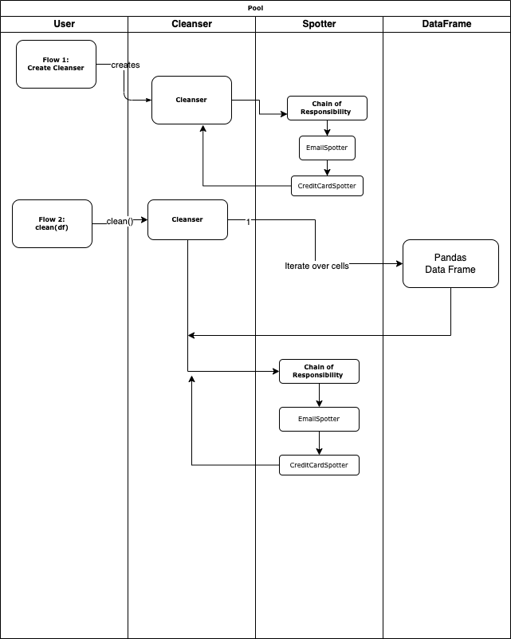

# Sanityze High-level Design

## 1. Overview
Data scientists often need to remove or redact Personal Identifiable Information (PII) from their data. This package provides utilities to spot and redact PII from Pandas data frames. 

>PII can be used to uniquely identify a person. This includes names, addresses, credit card numbers, phone numbers, email addresses, and social security numbers, and therefore regulatory bodies such as the European Union's General Data Protection Regulation (GDPR) and the California Consumer Privacy Act (CCPA) require that PII be removed or redacted from data sets before they are shared an further processed.

We occasionally have additional data about the people whose identities we want to conceal or redact. Occasionally we don't, since it's there's no convenient and reliable way to do so within the model training workflow. 

With the help of this package, it is simple to seamlessly remove personal information from Pandas DataFrames, maintaining the confidentiality of the individuals we are attempting to protect.

## 2. Concepts and Usage
Conceptually, `sanityze` is a package that provides a way to remove PII from Pandas data frames. The package provides a number of default spotters, which can be used to identify PII in the data and redact them. 

The main entry point to the package is the `Cleanser` class. The `Cleanser` class is used to add `Spotter`s to the cleanser, which will be used to identify PII in the data. The cleanser can then be used to cleanse the data, and redact the PII from the given data frame (all future data structures that will be suppportd by the package, in the future).

The package comes with a number of default spotters, as subclassess of `Spotter`:
1. `CreditCardSpotter` - identifies credit card numbers
2. `EmailSpotter` - identifies email addresses

Spotters can be added to it using the `add_spotter()` method. The cleanser can then be used to cleanse data using the `cleanse()` method which takes a Pandas data frame and returns a Pandas data frame with PII redacted.

The redaction options provided by `sanityze`` are:
1. Redact using a fixed string - The string in this case is the ID of the spotter. For example, if the spotter is an instance of `CreditCardSpotter`, the string will be `{{CREDITCARD}}`, or `{{EMAILADDRS}}` for an instance of `EmailSpotter`.
2. Redact using a hash of the input - The hash is computed using the `hashlib` package, and the hash function is `md5`. For example, if the spotter is an instance of `CreditCardSpotter`, the string will be `{{6a8b8c6c8c62bc939a11f36089ac75dd}}`, if the input is contains a PII `1234-5678-9012-3456`.

## 3. Design and Data Flow

More on the detailed use cases will be available soon, for now here's a high-level overview of the data flow:

